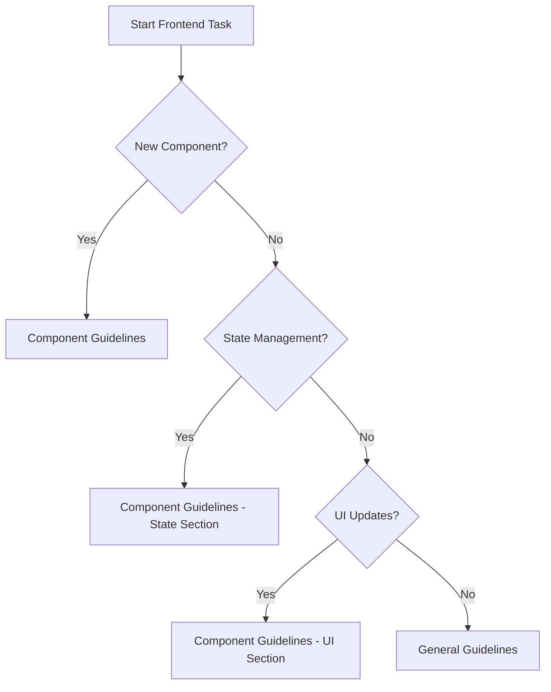
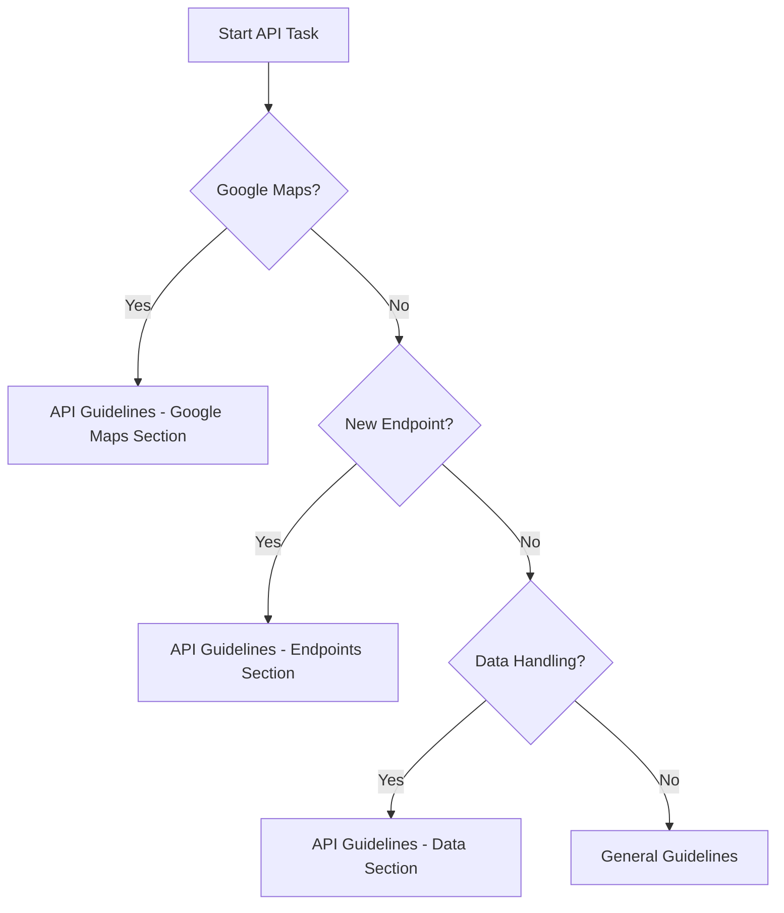
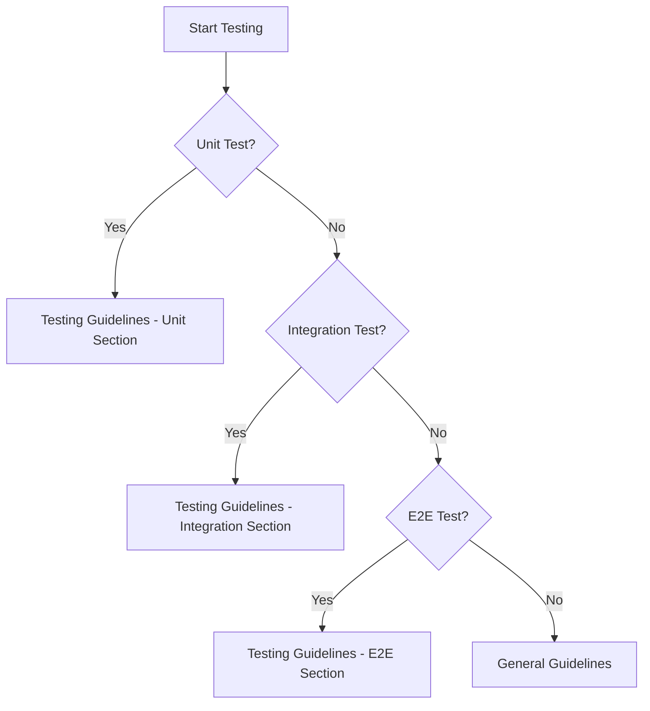

# Master Guidelines for Roof Estimator Pro

## Overview
This document serves as the central reference point for all development guidelines in the Roof Estimator Pro project. Use this guide to determine which specific guideline document to consult for your development needs.

## Quick Reference Guide

### 1. Starting a New Feature
- First, read [GUIDELINES.md](../GUIDELINES.md) for overall project architecture
- Then, follow these steps:
  1. Review component guidelines for UI implementation
  2. Check API guidelines for backend integration
  3. Consult testing guidelines for test requirements

### 2. Guidelines by Development Phase

#### Planning Phase
📄 [GUIDELINES.md](../GUIDELINES.md)
- Project structure
- Architecture decisions
- Technology stack
- Development workflow

#### Implementation Phase
📄 [COMPONENT_GUIDELINES.md](./COMPONENT_GUIDELINES.md)
- When building new UI components
- When modifying existing components
- For state management decisions
- For implementing UI interactions

📄 [API_GUIDELINES.md](./API_GUIDELINES.md)
- When integrating with Google Maps API
- When building new API endpoints
- For data fetching and caching
- For error handling strategies

#### Testing Phase
📄 [TESTING_GUIDELINES.md](./TESTING_GUIDELINES.md)
- When writing unit tests
- When implementing integration tests
- For E2E test scenarios
- For performance testing

## Decision Tree

### 1. Frontend Development

### 2. API Integration

### 3. Testing

## Common Development Scenarios

### 1. Adding a New Address Search Feature
1. Start with [COMPONENT_GUIDELINES.md](./COMPONENT_GUIDELINES.md)
   - Component structure
   - State management
2. Then [API_GUIDELINES.md](./API_GUIDELINES.md)
   - Google Places integration
   - Error handling
3. Finally [TESTING_GUIDELINES.md](./TESTING_GUIDELINES.md)
   - Unit tests
   - Integration tests

### 2. Implementing Roof Analysis
1. Start with [API_GUIDELINES.md](./API_GUIDELINES.md)
   - API endpoints
   - Data processing
2. Then [COMPONENT_GUIDELINES.md](./COMPONENT_GUIDELINES.md)
   - UI components
   - Data visualization
3. Finally [TESTING_GUIDELINES.md](./TESTING_GUIDELINES.md)
   - API testing
   - UI testing

### 3. Performance Optimization
1. Start with [GUIDELINES.md](../GUIDELINES.md)
   - Performance standards
2. Then specific guidelines based on focus:
   - UI: [COMPONENT_GUIDELINES.md](./COMPONENT_GUIDELINES.md)
   - API: [API_GUIDELINES.md](./API_GUIDELINES.md)
   - Testing: [TESTING_GUIDELINES.md](./TESTING_GUIDELINES.md)

## Maintenance and Updates

### Guidelines Priority
1. Security-related guidelines (Highest)
2. API integration guidelines
3. Component architecture guidelines
4. Testing guidelines
5. General development guidelines

### When to Update Guidelines
- During major version updates
- When introducing new technologies
- After identifying process improvements
- Based on team feedback

## Contribution Process

### Updating Guidelines
1. Create a new branch
2. Make changes to relevant guideline file
3. Update this master document if needed
4. Submit PR for review
5. Update team documentation

### Review Process
1. Technical review
2. Team lead approval
3. Documentation team review
4. Final approval

## Support and Questions

### When Guidelines Conflict
1. Follow the most specific guideline
2. Consult team lead for clarification
3. Document decision for future reference

### Getting Help
1. Review relevant guideline section
2. Check existing implementations
3. Consult team members
4. Update guidelines if needed

## Best Practices Summary

### Code Quality
- Follow TypeScript strict mode
- Implement proper error handling
- Write comprehensive tests
- Document complex logic

### Performance
- Optimize component renders
- Implement proper caching
- Monitor API performance
- Regular performance testing

### Security
- Secure API endpoints
- Validate user input
- Handle sensitive data properly
- Regular security audits

## Version Control

This document version: 1.0.0
Last updated: 2025-01-12

_Note: Always refer to the latest version of guidelines in the repository._
